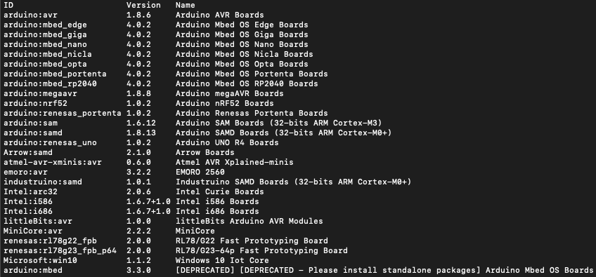
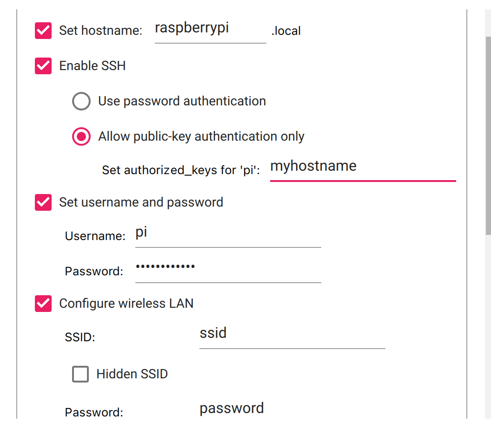

# Programming an Arduino Device Remotely Using a Raspberry Pi
What’s the advantage of programming our Arduino device remotely? For me, it’s because my electronic test gear (think power supplies, oscilloscopes, and analyzers) is in a different part of my workroom from where my computer is. Remotely programming my Arduino means I don’t have to run excessively long USB cables or move equipment I’m using to develop my project with the Arduino near my computer. 

When working with signals that can be dangerous to our computer’s USB bus, it’s essential to have some form of isolation layer. For example, if we’re working on an embedded project where we’re manipulating a 120 VAC signal, one small wiring mistake could expose our computer to this harmful signal!

In this article, we’ll explore how to program an Arduino with a blink sketch using a Raspberry Pi without needing to remote desktop into it, allowing us to run a few simple commands on a Linux or Mac command-line interface (CLI) each time we want to compile and upload code to our Arduino device.

Let’s get started!
## Overview
For this tutorial, we’ll use the [https://arduino.github.io/arduino-cli/0.33/](Arduino CLI) to compile our code on our main computer. Then, we’ll copy it to the Raspberry Pi. After we copy it, we’ll use the Arduino CLI on the Raspberry Pi to upload it to our Arduino. We want to compile on our main computer — it saves time since it will take much more time to compile on the  Raspberry Pi.

Here’s an overview of our workflow: 


## Prerequisites
To follow along, you’ll need the following:

* A Raspberry Pi — any model with  access to wifi will work 
* A cable to connect your Arduino board to the Raspberry Pi 
* A cable to power your Raspberry Pi
* An SD card to boot your Raspberry Pi from

## Installing the Raspberry Pi Image and Setting Up the Arduino CLI
We’ll start by installing the [https://www.raspberrypi.com/software/](Raspberry Pi Imager) to create the bootable SD for the Raspberry Pi. Scroll down and click the **Download** button for your operating system (OS). I’ll be using a Mac running on OSX for this demonstration.

**Note:** If you’re not using either a Mac or a computer running Ubuntu, you’ll have to manually download the latest `.img` file for the Raspberry Pi OS, tweak the Dynamic Host Configuration Protocol (DHCP) configuration to connect to your wifi network, and add the SSH file.

To install the Arduino CLI on Mac OSX, use [https://brew.sh/](Homebrew):

``` bash
brew update
brew install arduino-cli
```

Otherwise, use the manual install script for Linux:

```bash
curl -fsSL https://raw.githubusercontent.com/arduino/arduino-cli/master/install.sh | BINDIR=<Your Install Directory> sh
```

Ensure the directory you installed the Arduino CLI to is in your computer CLI’s `PATH` variable. 

Now, you need to install the board files for the specific Arduino Device you’re using. You can find the name of the package you have to install by running:

``` bash
arduino-cli core search <keywords>
```

If you want to see all board files that are avaliable, you can ommit the `<keywords>` argument to the search command. This will produce a list that looks like: 



The id field is the value we need when installing the board files. I’m using an older Arduino Nano that uses an AVR chip, so I’ll run the following:

``` bash
arduino-cli core install arduino:avr
```

However if you are using one of newer R4 boards like this [https://store-usa.arduino.cc/products/uno-r4-wifi](UNO R4 WiFi) you would have to run the following:

``` bash
arduino-cli core install arduino:renesas_uno
```

## Setting Up the Raspberry Pi
Start up the Raspberry Pi Imager on your main computer. Under the **Raspberry Pi OS (Other)** menu, set the operating system to be **Raspberry Pi OS Lite (32-bit)** and select the appropriate storage device using the **Choose Storage** menu.

Click on the **Settings** icon on the bottom right of the application. You might be prompted to enter your computer’s password to allow the tool to get access to the wifi password of the current network your computer is on. You can enter your password or click **no** — but note that if you click no, you’ll still have to enter that information later on. 

Still in the settings menu, make sure that Secure Shell (SSH) is enabled, the correct wifi credentials as specified, and that **Allow for public key authentication only** is selected. We want this option selected so we won’t need to enter a password each time we execute a command or copy data to the Raspberry Pi. 

Here is an example of what the selected options would look like in the settings menu:



`myhostname` should be whatever is auto populated for your computer.

Click **save** then **write**. Creating the bootable SD card will take a few minutes, so go grab some coffee ☕ while you wait!


Once the OS has been written to the SD card, remove it, put it into the Raspberry Pi and power it on. Once the Raspberry Pi boots, SSH into it by running the following command:

``` bash
ssh pi@raspberrypi.local
```

From there, update the Raspberry Pi's aptitude package registry and update existing packages on the OS to the newest versions:

```bash
sudo apt-get update
sudo apt-get -y upgrade
```

Next, install the Arduino CLI to `~/local/bin` and add that path to the shell's `PATH` environment variable using the commands below:

```bash
mkdir -p ~/local/bin
curl -fsSL https://raw.githubusercontent.com/arduino/arduino-cli/master/install.sh | BINDIR=~/local/bin sh
echo 'export PATH=$PATH:~/local/bin' >> ~/.bashrc
source ~/.bashrc
```

We’re ready to start compiling and uploading code!
## Using the Arduino CLI to Program the Arduino
On your computer, create a directory called `blink` and add a directory called `bin` to it. Create a file called `blink.ino` and add the following to it:

```cpp
void setup() {
 pinMode(LED_BUILTIN, OUTPUT);
}

void loop() {
 digitalWrite(LED_BUILTIN, HIGH);
 delay(1000);                    
 digitalWrite(LED_BUILTIN, LOW);  
 delay(1000);                   
}
```

Return to the `blink` directory. This is where you’ll run the compile command to build your sketch and place the created binaries in the `bin` folder. 

Since I’m using the Arduino Nano under the AVR family, I’ll run the following:

``` bash
arduino-cli compile -b arduino:avr:nano --output-dir=./bin
```

**Note:** Be sure to replace the board name with the specific board you’re using.

Next, we need to make sure that the Raspberry Pi has a directory on it to transfer our binaries to. We’ll use SSH to accomplish this. Note that you only need to do this once! 

To create this directory from your computer, run:

``` bash
ssh pi@raspberrypi.local 'mkdir -p ~/blink'
```

We’ll use the secure copy protocol (SCP) to upload our binary files to the Raspberry Pi. To upload the binaries from your computer to the `~/blink` directory on the Raspberry Pi, run:

``` bash
scp bin/* pi@raspberrypi.local:~/blink
```

Next, we’ll upload the code from the Raspberry Pi using the Arduino CLI `upload` command on your computer:

```bash 
ssh pi@rasperrypi.local '/home/pi/local/bin/arduino-cli upload -b arduino:avr:nano -p /dev/ttyUSB0 --input-dir=/home/pi/blink'
```

**Note:** My Arduino Nano is mounted to `/dev/ttyUSB0`. You can find what port your Arduino will be programmed from by running `ssh ssh pi@rasperrypi.local 'ls /dev/'` and comparing the output from when the device is plugged in to when it is not. There will be a path that is is missing the second time you run this command. This path will be what you have to specify in the upload command as the programmer's path. If you are using an external programmer like the [https://reprap.org/wiki/USBasp](USBasp), the Arduino CLI should find what port the device is connected to if you just specify the name of the programmer. In this case you can replace the argument `-p /dev/ttyUSB0` with `-P uspasp` in the upload command. 

If you want to run only one command instead of three each time, you can concatenate the command with the `&&` bash operator:

`arduino-cli compile -b arduino:avr:nano --output-dir=./bin && scp bin/* pi@raspberrypi.local:~/blink && ssh pi@rasperrypi.local '/home/pi/local/bin/arduino-cli upload -b arduino:avr:nano -p /dev/ttyUSB0 --input-dir=/home/pi/blink'`

This will run all three commands synchronously. Be careful though — if one of those commands fails, the next command in the sequence won't run.
## Conclusion
There you go! You now have a blink sketch running on your Arduino that you uploaded remotely from your main computer.
