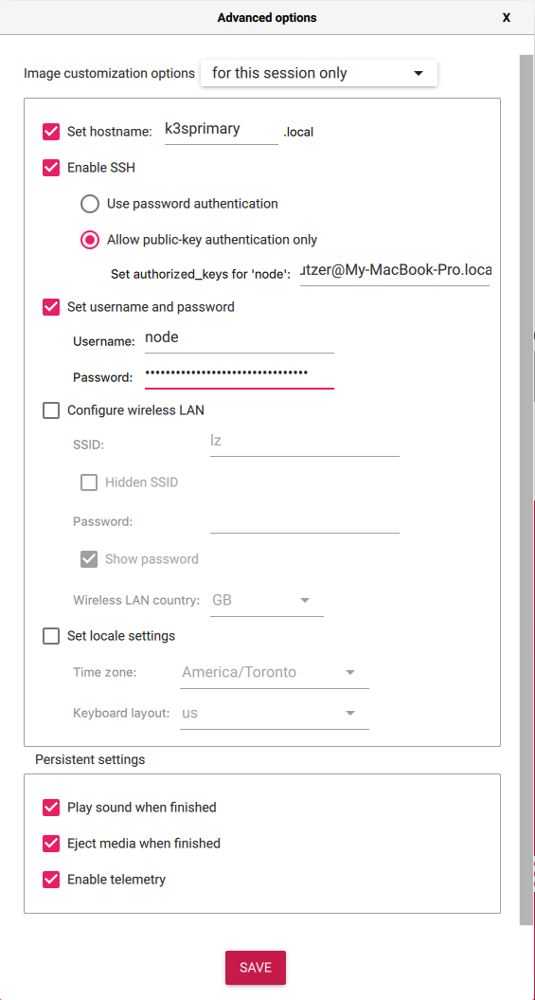
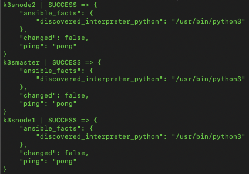
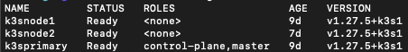
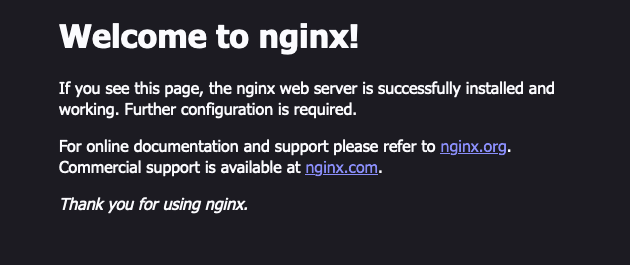

# Raspberry Pi Kubernetes Cluster with K3s and Metallb

Understanding Kubernetes is crucial to having a successful career as a backend or full-stack developer. Many companies like Google, Spotify, Amazon, and Reddit use Kubernetes to host and manage their services. However, it can be expensive to have a persistent Kubernetes cluster where you can run long-term experiments to learn. For example, a two node cluster with load balancing on Linode costs around $40 USD a month. If you have an old computer or Raspberry Pi kicking around you can make a bare metal cluster using K3s. In this tutorial, I go over how to make a K3s cluster on a few Raspberry Pis and show how to expose services on your network using Metallb. I then show how to run a simple nginx server and service to demonstrate the cluster is working.

In today's digital landscape, owning and managing your software infrastructure has become an increasingly appealing option for individuals and organizations alike. The desire for control, privacy, and customization has driven a surge in the popularity of self-hosting solutions. With technologies like K3s and MetalLB at your disposal, creating and maintaining your self-hosted applications and services has never been easier.

## K3s, Metallb and Kubernetes

Kubernetes allows you to run multiple containerized services with a shared pool of resources. In Kubernetes, there are two types of nodes; A working node and the primary node. The primary node runs the Kubernetes server instance. This server manages all of the running Kubernetes Services, Pods, Deployments, and other objects. It will start new container deployments on worker nodes when needed, coordinate with a DNS server to create records for service-to-service discovery, manage the networking between the different nodes, and many other tasks.

K3s like Google Kubernetes Engine, or Azure Kubernetes Service implement the Kubernetes APIs. However, K3s is optimized to run on an ARM CPU. This makes K3s perfect for running on low-cost ARMv8-based Raspberry Pi 4s. In our K3s Raspberry Pi base cluster, each Raspberry Pi can be seen as an individual node. Our primary node will run the K3s server as well as the K3s agent program to maximize its resource usage. All other nodes will just run the K3s agent.

With a cloud-provided Kubernetes Engine, we can easily expose our services using a type `LoadBalancer` Kubernetes Service Object. In AWS this will then provision a dedicated Elastic Load Balancer that will direct traffic from it's IP to the connected Kubernetes Pods. In the bare-metal world, we don't have the luxury of dedicated Loadbalancers! Instead, we can use tools like [Metallb](https://metallb.com) to provide the same functionality. 

With Metallb in Layer 2 Mode, each of the Raspberry Pis will have a `speaker` Kubernetes Daemon Set running on them. The Pod in the Daemon Set "announces" the IPs of the services running on this Raspberry Pi to other devices on the network. Let's say we are running a nginx server on node1. When your computer does an address resolution protocol (ARP) request on the IP assigned to that nginx server, the MAC address that is returned will node1's. This effectively gives you the functionality of a load balancer without needing the dedicated hardware on your network.

**Note:** If you have only one Raspberry Pi, you can complete the activity in this tutorial! Just ignore the parts that talk about setting up or managing additional nodes. Because K3s on the primary node also run the agent, you will still be able to run services on this single-node cluster.

## Requirements

I am assuming that your main computer runs either Linux or OSx, however, the commands specified in the following sections can be adapted to work on Windows. On your computer, you should have the [Raspberry Pi Imager](https://raspberrypiimager) installed. This will be used to create the boot media for the Raspberry Pi. You will also need to install [Ansible](https://docs.ansible.com/ansible/latest/installation_guide/intro_installation.html) for managing and setting up the Raspberry Pis. I suggest installing it with [pip](https://pypi.org/project/ansible/). To manage your K3s cluster you will also need [kubectl](https://kubernetes.io/docs/tasks/tools/) on your computer.

### Raspberry Pis

You will need to have **at least one** Raspberry Pi with a minimum of 1 GB of RAM. If you are purchasing a Raspberry Pi for a Kubernetes Cluster, I would recommend getting a Pi 4 with 8GB of RAM. At the time of this writing, Pi 4s are much more available and can be purchased for about $100 CAD.

To boot the Raspberry Pi you will need an SD card for each one, however, I do recommend USB booting with an SSD or a flash drive. This will make your nodes much more stable and responsive to service deployments. You can pick up a [Kingston A400 120GB SSD](https://www.canadacomputers.com/product_info.php?cPath=179_4229&item_id=105078) for $27 CAD and a [5GPS SATA to USB3 adapter](https://www.amazon.ca/UGREEN-Adapter-Converter-Support-Driver-Free/dp/B07Y82BFDL) for $20 CAD. I won’t discuss how to boot a Pi from USB in this tutorial but you can find instructions on how to do that [here](https://www.zdnet.com/article/booting-my-raspberry-pi-4-from-a-usb-device/). 

**Note:** Make sure that your power supply can give enough power to both your Raspberry Pi and any other peripherals you will connect! The Raspberry Pi Foundation recommends a 3A 5.1 V supply (15W) for a Pi 4.

## Setting Up the Boot Media
The steps to creating the boot media will be the same whether you are setting up an SSD to be booted from USB or an SD card. This step will need to be repeated for **each** Raspberry Pi you are setting up for the cluster.

Open up the Raspberry Pi Imager tool. From the menu select the device you want to create the boot media on, as well as `Raspberry Pi OS 64 (Lite)` as the OS. Click on the advanced options button (gear icon). The hostname that is set, will be its name in Kubernetes. Use `k3sprimary` for your primary node, and the schema `k3snodeXX` where `XX` is an incremented whole number for any other nodes. Select `Enable SSH` and `Allow public-key authentication only`. Set the user name to be `node` and the password to be something that is autogenerated. I suggest you use OpenSSL's rand command like `openssl rand -base64 24` to generate a password. I recommend you use a switch to network your Pis. You can use the switch built into the modem your ISP provides.

For your primary node, the settings menu should look something like: 



## Networking the Raspberry Pis

Connect each of the Raspberry Pis to the switch and power them on. For **each** of the Raspberry Pis, you will need to SSH into them using a tool like Putty, or your computer's OpenSSH command. To get the IP Address of each of the Raspberry Pis use your router's admin panel to see the DHCP leases, or use `nmap`. Use the following command to SSH into the primary node with OpenSSH `ssh node@<PRIMARY IP>` where `<PRIMARY IP>` is the address of your primary node retrieved in the previous step. Once you have an established SSH connection, open up the networking config for the Pi by running `sudo nano /etc/dhcpcd.conf`. We need to modify this file so that our Pi has a static IP. My primary node has an IP of 192.168.4.200 and I increment the IP by 1 for each of my regular nodes. Scroll down the file until you see the comment `# Example static IP configuration:`. Uncomment the `interface`, `static router`, and `static domain_name_server` lines. Fill that information with your network's specific setup. The configuration for my primary node is: 

``` conf
# Example static IP configuration:
interface eth0
static ip_address=192.168.4.200/24
#static ip6_address=fd51:42f8:caae:d92e::ff/64
static routers=192.168.4.1
static domain_name_servers=192.168.4.1 1.1.1.1 8.8.8.8
```

Once you have saved that file, run the command `sudo mkdir -p /root/.ssh && sudo cp ~/.ssh/authorized_keys /root/.ssh`. This will copy your computer's public key to the root user's SSH configuration, allowing Ansible to run root-privileged commands over SSH. 

## Creating the Ansible Configuration for the Cluster
Ansible is popular for automating the configuration of network-connected devices. How Ansible works, won't be discussed in this blog. If you want to learn more about Ansible, take a look at the [free ebooks](https://ansible.jeffgeerling.com/) Jeff Geerling has created on this topic.

You need to set up a `host.ini` file that contains the IP addresses of the Raspberry Pis we want to configure. If you installed Ansible with `pip` all you will need to do is create a file under `~/.ansible/host.ini`. The host file should look like:

``` conf
[all]
k3sprimary ansible_ssh_host=192.168.4.200
k3snode1 ansible_ssh_host=192.168.4.201
k3snode2 ansible_ssh_host=192.168.4.202

[all:vars]
ansible_user=root

[k3snodes]
k3snode1
k3snode2
```

You will need to replace the `ansible_ssh_host` definition with the appropriate IP addresses. Note that in the hosts file, we can group devices by placing the hostnames under a group name like `[name]`. This allows you to run Ansible commands that target specific groups of devices. To verify that Ansible can connect to the Raspberry Pis, run the command `ansible all -m ping`. You should see the following response in your terminal:



## Install K3s on the Raspberry Pis

To install the K3s on the Raspberry Pi we first need to download the installer script. Run this Ansible command to do that `ansible all -m get_url -a "url=https://get.k3s.io dest=/tmp/k3s mode=0755"`. This will download the installer script to the `/tmp` directory on each of the Raspberry Pis. Next, install K3s on your primary node. Run `ansible k3sprimary -e INSTALL_K3S_EXEC=--disable=servicelb -e K3S_KUBECONFIG_MODE=644 -a "bash /tmp/k3s" -v`. 

**Note:** We are disabling ServiceLB which comes default with K3s as it interferes with Metallb.

On completion, of this operation, you can copy the Kubernetes config for the primary node to your local machine. Run the command `scp root@<PRIMARY IP>:/etc/rancher/k3s/k3s.yaml ~/.kube/config` and replace `<PRIMARY IP>` with your primary node's IP. You will need to modify the local `~/.kube/config` file on your computer. Run `nano ~/.kube/config` and change the line that defines `server:` from `127.0.0.1` to the IP of your primary node.

Now get the Node Token that authorizes additional nodes to interact with your primary node. To do this run `ssh node@<PRIMARY IP> "sudo cat /var/lib/rancher/k3s/server/node-token"` with your primary nodes IP and make note of the output. Now to install K3s on the additional nodes run `ansible k3snodes -e K3S_TOKEN=<TOKEN> -e K3S_URL="https://<PRIMARY IP>:6443" -e K3S_NODE_NAME={{inventory_hostname}} -a "bash /tmp/k3s" -v`. Replace `<TOKEN>` with the token you got from the output of the previous command, and `<PRIMARY IP>` with the IP of the primary node. Verify that all the nodes are integrated with the cluster by running `kubectl get nodes`. You should see the following output:



## Installing Metallb In Your Cluster

To install Metallb on your cluster run `kubectl apply -f https://raw.githubusercontent.com/metallb/metallb/main/config/manifests/metallb-native.yaml`. Watch the pods in the `metallb-system` namespace come online by running `kubectl get pods -n metallb-system`

### Configuring Metallb

Metallb needs a range of IP addresses that it can allocate to different Kubernetes Service Objects. To give Metallb a range of IP addresses, create a file called `metallb-config.yml` with the following contents:

``` yml 
apiVersion: metallb.io/v1beta1
kind: IPAddressPool
metadata:
  name: pool
  namespace: metallb-system
spec:
  addresses:
  - <IP RANGE> # example: 192.168.1.5-192.168.1.10
---
apiVersion: metallb.io/v1beta1
kind: L2Advertisement
metadata:
  name: l2-advertisement
  namespace: metallb-system
spec:
  ipAddressPools:
  - pool
```
Make sure you replace the `<IP RANGE>` line with something that is appropriate for your network. If you can, use an IP range that is not allocated for your router's DHCP service. An example IP range is `192.168.1.5-192.168.1.10`. Apply the configuration by running `kubectl apply -f metallb-config.yml`. Now Metallb will now be able to advertise the IP addresses in the range you specified to other devices on your network.

## Testing your Cluster with nginx

To setup a simple nginx deployment to test that your cluster is working, run the following commands to create a nginx pod and service:

`kubectl run my-nginx --image=nginx --port=80`
`kubectl expose pod my-nginx --port=80 --type=LoadBalancer --load-balancer-ip=<IP ADDRESS> # example: 192.168.1.5`

Change `<IP ADDRESS>` to a free IP address in the range you specified in the Metallb configuration. Navigate to that IP address in the browser of your choice and you should see the following page: 



Congratulations 🥳! You have set up a working K3s cluster with Raspberry Pis. To remove the nginx pod and service run:

`kubectl delete pod my-nginx && kubectl delete service my-nginx`

## Conclusion

K3s is a Kubernetes variant that is optimized for ARM CPUs. This makes it perfect for running on Raspberry Pis. In this tutorial we went over how to setup a K3s cluster on Raspberry Pis, and how to expose services on your network using Metallb. With Metallb we can expose services on our network without needing dedicated load balancer hardware like on a cloud variant of Kubernetes. This not only saves cost, but simplifies your cluster setup!

## What's Next? 

If you would like to continue experimenting with K3s I would recommend installing [Longhorn](https://docs.k3s.io/storage#setting-up-longhorn) in your cluster. There are some additional changes you will need to make to your Raspberry Pis, but it will give you persistent and redundant storage. Currently, if you would want to save data from one of your services you would have to define a PersistentVolumenClaim object that allocates disk memory on a specific node. If that node goes offline you will lose your data! Longhorn distributes data across multiple nodes to eliminate that problem. 

